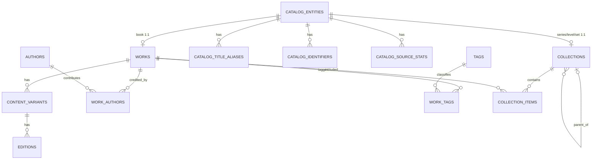
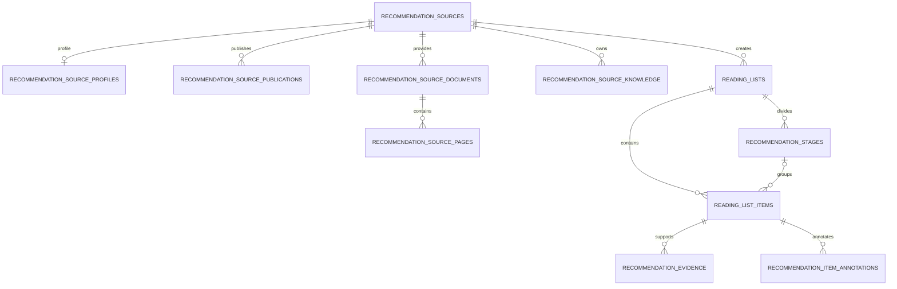
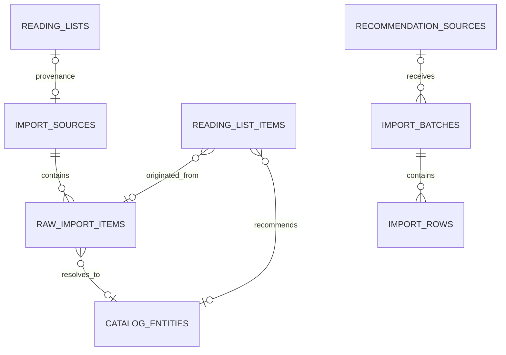

# ReadingMap 当前数据库设计文档

> 文档性质：**现状文档（As-Built）**，描述当前正在运行的 `reading_map` 数据库，而不是未来规划或重构提案。  
> 核对时间：2026-09-03（Asia/Shanghai）  
> 核对方式：直接读取 MySQL `information_schema`、SQLAlchemy Inspector、Alembic 版本表及实时行数。

## 1. 数据库基线

| 项目 | 当前值 |
|---|---|
| DBMS | MySQL 8.4.11 |
| 数据库名 | `reading_map` |
| 字符集 | `utf8mb4` |
| 排序规则 | `utf8mb4_unicode_ci` |
| Alembic 当前版本 | `20260902_0006` |
| 物理表数量 | 32（含 `alembic_version`） |
| 数据与索引占用 | 2,588,672 bytes（约 2.47 MiB） |
| 主键策略 | 业务表以自增 `INTEGER` 为主；关联表使用复合主键 |
| 时间类型 | `DATETIME` / `DATE`，当前表结构不保存时区 |

本文档的物理结构以实时数据库为准。SQLAlchemy 模型位于 `backend/app/models/`，迁移版本位于 `backend/alembic/versions/`。

## 2. 核心设计结论

当前数据库分为四个主要业务域：

1. **统一目录域**：用 `catalog_entities` 表示可展示、可匹配、可推荐的目录实体。
2. **图书明细域**：用 `works`、`content_variants`、`editions` 保存单本书、内容版本和出版版本。
3. **推荐知识域**：保存推荐人、书单、阶段、条目、证据、来源文档和知识材料。
4. **导入追踪域**：保存原始输入及解析结果，使目录可以重建并追溯到原始资料。

### 2.1 `catalog_entities` 与 `works` 的边界

- `catalog_entities` 是统一目录入口，实体类型由 `entity_type` 区分：`book`、`series`、`level`、`set`。
- `works` 没有被删除，也不应该为空。它保存**确认为单本书的作品级信息**。
- 当前 242 条 `works` 全部通过非空且唯一的 `catalog_entity_id` 与 242 条 `book` 类型目录实体一一对应。
- 系列、级别和套装不存进 `works`，而由 `catalog_entities` 配合 `collections` 表达。
- 当前唯一没有 `catalog_entity_id` 的 `collections` 记录是 `personal_shelf`，它是用户书架容器，不属于公共目录实体。

### 2.2 关键数据流

```text
外部资料/旧数据
    -> import_sources
    -> raw_import_items（保留原文）
    -> 解析/匹配
    -> catalog_entities（统一目录）
       -> works（单本书） -> content_variants -> editions
       -> collections（系列/级别/套装） -> collection_items -> works

推荐来源
    -> reading_lists
    -> recommendation_stages
    -> reading_list_items
       -> raw_import_items（原始输入）
       -> catalog_entities（解析后的目录实体）
       -> recommendation_evidence / recommendation_item_annotations
```

## 3. 逻辑关系图

### 3.1 目录与图书



### 3.2 推荐来源与书单



### 3.3 导入与解析



## 4. 当前数据快照

### 4.1 全表行数

| 表 | 行数 | 表 | 行数 |
|---|---:|---|---:|
| `alembic_version` | 1 | `authors` | 1 |
| `catalog_entities` | 526 | `catalog_identifiers` | 0 |
| `catalog_source_stats` | 0 | `catalog_title_aliases` | 0 |
| `collection_items` | 240 | `collections` | 285 |
| `content_variants` | 242 | `editions` | 242 |
| `import_batches` | 2 | `import_rows` | 2 |
| `import_sources` | 17 | `raw_import_items` | 1,079 |
| `reading_list_items` | 555 | `reading_lists` | 16 |
| `recommendation_evidence` | 505 | `recommendation_item_annotations` | 1,715 |
| `recommendation_source_documents` | 12 | `recommendation_source_knowledge` | 8 |
| `recommendation_source_pages` | 115 | `recommendation_source_profiles` | 5 |
| `recommendation_source_publications` | 4 | `recommendation_sources` | 5 |
| `recommendation_stages` | 66 | `series` | 0 |
| `series_items` | 0 | `tags` | 0 |
| `work_aliases` | 0 | `work_authors` | 1 |
| `work_tags` | 0 | `works` | 242 |

### 4.2 关键枚举分布

| 维度 | 当前分布 |
|---|---|
| `catalog_entities.entity_type` | `book` 242；`series` 277；`level` 7；`set` 0 |
| `collections.collection_type` | `picture_book` 128；`graded_reader` 108；`bridge_book` 16；`chapter_book` 13；`early_chapter` 10；`catalog` 8；`comic` 1；`personal_shelf` 1 |
| `reading_list_items.item_type` | `series` 389；`animation` 85；`material` 23；`audio` 21；`resource` 21；`app` 8；`level` 5；`video` 3 |
| `raw_import_items.resolve_status` | `resolved` 917；`non_catalog` 161；`resolved_multiple` 1 |
| `raw_import_items.resolve_source` | `auto` 1,079 |
| `import_sources.source_type` | `legacy_reading_list` 16；`legacy_catalog_snapshot` 1 |
| `import_sources.status` | `completed` 17 |

### 4.3 实时完整性检查

| 检查项 | 结果 |
|---|---:|
| 无目录实体的 `works` | 0 |
| 指向不存在目录实体的 `collections` | 0 |
| 指向不存在原始项的 `reading_list_items` | 0 |
| 无导入来源的 `raw_import_items` | 0 |
| 未关联 `raw_import_item_id` 的 `reading_list_items` | 0 |
| 未关联目录实体的 `collections` | 1（`personal_shelf`，符合设计） |

## 5. 物理表设计

说明：`NN` 表示 `NOT NULL`，`NULL` 表示可空；`PK` 为主键，`FK` 为外键，`UQ` 为唯一约束。

## 5.1 统一目录域

### `catalog_entities` — 统一目录实体

| 字段 | 类型 | 空值/键 | 说明 |
|---|---|---|---|
| `id` | INTEGER | PK, NN | 目录实体 ID |
| `entity_type` | VARCHAR(32) | NN, CHECK | `book` / `series` / `level` / `set` |
| `display_title` | VARCHAR(500) | NN | 面向用户的主标题 |
| `normalized_display_title` | VARCHAR(500) | NN | 归一化主标题，用于匹配与检索 |
| `original_title` | VARCHAR(500) | NULL | 原文标题 |
| `normalized_original_title` | VARCHAR(500) | NULL | 归一化原文标题 |
| `cover_url` | VARCHAR(1000) | NULL | 远程封面地址 |
| `cover_local_path` | VARCHAR(1000) | NULL | 本地封面路径 |
| `created_at` | DATETIME | NN | 创建时间，默认 `now()` |
| `updated_at` | DATETIME | NN | 更新时间，默认 `now()` |

约束与索引：检查约束 `ck_catalog_entity_type`；为展示标题、原文标题及两个归一化标题分别建立普通索引。

### `catalog_title_aliases` — 目录标题别名

| 字段 | 类型 | 空值/键 | 说明 |
|---|---|---|---|
| `id` | INTEGER | PK, NN | 别名 ID |
| `catalog_entity_id` | INTEGER | FK, NN | 目录实体，删除实体时级联删除 |
| `title` | VARCHAR(500) | NN | 别名原文 |
| `normalized_title` | VARCHAR(500) | NN | 归一化别名，已建索引 |
| `language` | VARCHAR(32) | NULL | 语言代码 |

唯一约束：`(catalog_entity_id, title)`。

### `catalog_identifiers` — 目录外部标识

| 字段 | 类型 | 空值/键 | 说明 |
|---|---|---|---|
| `id` | INTEGER | PK, NN | 标识记录 ID |
| `catalog_entity_id` | INTEGER | FK, NN | 目录实体，删除实体时级联删除 |
| `identifier_type` | VARCHAR(32) | NN | 标识类型，如 `isbn10`、`isbn13` |
| `identifier_value` | VARCHAR(255) | NN | 标识值 |

唯一约束：`(identifier_type, identifier_value)`，保证同类外部标识全库唯一。

### `catalog_source_stats` — 外部平台统计

| 字段 | 类型 | 空值/键 | 说明 |
|---|---|---|---|
| `id` | INTEGER | PK, NN | 统计记录 ID |
| `catalog_entity_id` | INTEGER | FK, NN | 目录实体，删除实体时级联删除 |
| `source` | VARCHAR(64) | NN | 数据平台 |
| `region` | VARCHAR(32) | NULL | 地区 |
| `external_id` | VARCHAR(255) | NULL | 平台侧 ID |
| `external_url` | VARCHAR(1000) | NULL | 平台页面 |
| `rating` | DECIMAL(5,2) | NULL | 评分 |
| `rating_max` | DECIMAL(5,2) | NULL | 评分满分 |
| `rating_count` | INTEGER | NULL | 评分人数 |
| `review_count` | INTEGER | NULL | 评论人数 |
| `updated_at` | DATETIME | NULL | 抓取/更新时间 |

索引：`(catalog_entity_id, source, region)`。

## 5.2 图书、版本与集合域

### `works` — 单本作品

| 字段 | 类型 | 空值/键 | 说明 |
|---|---|---|---|
| `id` | INTEGER | PK, NN | 作品 ID |
| `canonical_title` | VARCHAR(500) | NN | 作品规范标题 |
| `normalized_title` | VARCHAR(500) | NN | 归一化标题，已建索引 |
| `original_title` | VARCHAR(500) | NULL | 原文标题 |
| `original_language` | VARCHAR(32) | NULL | 原始语言 |
| `description` | TEXT | NULL | 内容简介 |
| `created_at` | DATETIME | NN | 创建时间 |
| `updated_at` | DATETIME | NN | 更新时间 |
| `catalog_entity_id` | INTEGER | FK, UQ, NN | 对应 `book` 目录实体；删除目录实体时级联删除作品 |
| `page_count` | INTEGER | NULL | 汇总页数 |
| `word_count` | INTEGER | NULL | 汇总词数 |
| `ar` | DECIMAL(6,2) | NULL | Accelerated Reader 难度 |
| `lexile` | INTEGER | NULL | Lexile 值 |

核心约束：`catalog_entity_id` 非空且唯一，实现 `catalog_entities` 与 `works` 的 1:1 关系。

### `authors` — 作者

| 字段 | 类型 | 空值/键 | 说明 |
|---|---|---|---|
| `id` | INTEGER | PK, NN | 作者 ID |
| `name` | VARCHAR(255) | NN | 姓名 |
| `normalized_name` | VARCHAR(255) | NN | 归一化姓名，已建索引 |
| `created_at` | DATETIME | NN | 创建时间 |
| `updated_at` | DATETIME | NN | 更新时间 |

### `work_authors` — 作品与作者关联

| 字段 | 类型 | 空值/键 | 说明 |
|---|---|---|---|
| `work_id` | INTEGER | PK, FK, NN | 作品；删除作品时级联删除 |
| `author_id` | INTEGER | PK, FK, NN | 作者；删除作者时级联删除 |
| `role` | VARCHAR(64) | PK, NN | 角色，如 author / illustrator |
| `position` | INTEGER | NULL | 署名顺序 |

复合主键及唯一约束：`(work_id, author_id, role)`。

### `work_aliases` — 作品旧式别名

| 字段 | 类型 | 空值/键 | 说明 |
|---|---|---|---|
| `id` | INTEGER | PK, NN | 别名 ID |
| `work_id` | INTEGER | FK, NN | 作品；删除作品时级联删除 |
| `alias` | VARCHAR(500) | NN | 别名 |
| `normalized_alias` | VARCHAR(500) | NN | 归一化别名，已建索引 |
| `language` | VARCHAR(32) | NULL | 语言 |
| `source` | VARCHAR(255) | NULL | 别名来源 |

说明：新统一目录同时提供 `catalog_title_aliases`；本表保留作品层别名结构，当前无数据。

### `content_variants` — 内容版本

| 字段 | 类型 | 空值/键 | 说明 |
|---|---|---|---|
| `id` | INTEGER | PK, NN | 内容版本 ID |
| `work_id` | INTEGER | FK, NN | 所属作品；删除作品时级联删除 |
| `language` | VARCHAR(32) | NULL | 内容语言 |
| `variant_type` | VARCHAR(32) | NN | 版本类型，默认由应用层提供 `unknown` |
| `title` | VARCHAR(500) | NN | 版本标题 |
| `translator` | VARCHAR(255) | NULL | 译者 |
| `description` | TEXT | NULL | 版本说明 |
| `created_at` | DATETIME | NN | 创建时间 |
| `updated_at` | DATETIME | NN | 更新时间 |

索引：`(work_id, language)`。

### `editions` — 出版版本

| 字段 | 类型 | 空值/键 | 说明 |
|---|---|---|---|
| `id` | INTEGER | PK, NN | 出版版本 ID |
| `content_variant_id` | INTEGER | FK, NN | 内容版本；删除内容版本时级联删除 |
| `isbn10` | VARCHAR(16) | UQ, NULL | ISBN-10 |
| `isbn13` | VARCHAR(20) | UQ, NULL | ISBN-13 |
| `publisher` | VARCHAR(255) | NULL | 出版社 |
| `publish_date` | DATE | NULL | 出版日期 |
| `format` | VARCHAR(32) | NULL | 装帧/介质 |
| `pages` | INTEGER | NULL | 页数 |
| `word_count` | INTEGER | NULL | 词数 |
| `cover_url` | VARCHAR(1000) | NULL | 版本封面 |
| `created_at` | DATETIME | NN | 创建时间 |
| `updated_at` | DATETIME | NN | 更新时间 |

唯一索引：`isbn10`、`isbn13` 各自全库唯一；MySQL 允许多个 `NULL`。

### `collections` — 系列、级别、套装及书架容器

| 字段 | 类型 | 空值/键 | 说明 |
|---|---|---|---|
| `id` | INTEGER | PK, NN | 集合 ID |
| `title` | VARCHAR(500) | NN | 集合标题 |
| `publisher` | VARCHAR(255) | NULL | 出版社 |
| `language` | VARCHAR(32) | NULL | 语言 |
| `collection_type` | VARCHAR(64) | NN | 业务分类或 `personal_shelf` |
| `isbn` | VARCHAR(20) | UQ, NULL | 集合 ISBN |
| `cover_url` | VARCHAR(1000) | NULL | 封面 |
| `description` | TEXT | NULL | 描述 |
| `created_at` | DATETIME | NN | 创建时间 |
| `updated_at` | DATETIME | NN | 更新时间 |
| `catalog_entity_id` | INTEGER | FK, UQ, NULL | 公共目录实体；删除实体时级联删除集合 |
| `parent_collection_id` | INTEGER | FK, NULL | 父集合；父集合删除时置空 |
| `volume_count` | INTEGER | NULL | 册数 |

说明：目录型集合通过唯一 `catalog_entity_id` 与 `series` / `level` / `set` 实体一一对应；`personal_shelf` 允许不绑定目录实体。

### `collection_items` — 集合成员

| 字段 | 类型 | 空值/键 | 说明 |
|---|---|---|---|
| `id` | INTEGER | PK, NN | 成员记录 ID |
| `collection_id` | INTEGER | FK, NN | 集合；删除集合时级联删除 |
| `work_id` | INTEGER | FK, NN | 作品；删除作品时级联删除 |
| `content_variant_id` | INTEGER | FK, NULL | 指定内容版本；删除时置空 |
| `edition_id` | INTEGER | FK, NULL | 指定出版版本；删除时置空 |
| `position` | INTEGER | NULL | 集合内顺序 |
| `quantity` | INTEGER | NN | 数量，默认由应用层提供 1 |

### `series` — 旧式系列定义

| 字段 | 类型 | 空值/键 | 说明 |
|---|---|---|---|
| `id` | INTEGER | PK, NN | 系列 ID |
| `name` | VARCHAR(255) | NN | 系列名 |
| `language` | VARCHAR(32) | NULL | 语言 |
| `publisher` | VARCHAR(255) | NULL | 出版社 |
| `description` | TEXT | NULL | 描述 |

说明：当前无数据。现行目录系列主要由 `catalog_entities(entity_type='series') + collections` 表达。

### `series_items` — 旧式系列成员

| 字段 | 类型 | 空值/键 | 说明 |
|---|---|---|---|
| `series_id` | INTEGER | PK, FK, NN | 系列；删除时级联删除 |
| `work_id` | INTEGER | PK, FK, NN | 作品；删除时级联删除 |
| `content_variant_id` | INTEGER | FK, NULL | 内容版本；删除时置空 |
| `position` | INTEGER | NULL | 顺序 |
| `volume_number` | VARCHAR(64) | NULL | 册号 |
| `level_system` | VARCHAR(64) | NULL | 分级体系 |
| `level_value` | VARCHAR(64) | NULL | 分级值 |

复合主键：`(series_id, work_id)`；另有唯一约束 `(series_id, work_id, content_variant_id)`。当前无数据。

### `tags` — 标签字典

| 字段 | 类型 | 空值/键 | 说明 |
|---|---|---|---|
| `id` | INTEGER | PK, NN | 标签 ID |
| `category` | VARCHAR(64) | NN | 标签类别 |
| `name` | VARCHAR(255) | NN | 标签名 |

唯一约束：`(category, name)`。当前无数据。

### `work_tags` — 作品标签关联

| 字段 | 类型 | 空值/键 | 说明 |
|---|---|---|---|
| `work_id` | INTEGER | PK, FK, NN | 作品；删除时级联删除 |
| `tag_id` | INTEGER | PK, FK, NN | 标签；删除时级联删除 |
| `confidence` | DECIMAL(4,3) | NULL | 标签置信度 |
| `source` | VARCHAR(255) | NULL | 标签来源 |

复合主键：`(work_id, tag_id)`。当前无数据。

## 5.3 推荐来源与知识域

### `recommendation_sources` — 推荐来源主体

| 字段 | 类型 | 空值/键 | 说明 |
|---|---|---|---|
| `id` | INTEGER | PK, NN | 来源 ID |
| `name` | VARCHAR(255) | NN | 来源名称 |
| `source_type` | VARCHAR(64) | NN | 来源类型 |
| `platform` | VARCHAR(255) | NULL | 平台 |
| `profile_url` | VARCHAR(1000) | NULL | 主页地址 |
| `notes` | TEXT | NULL | 备注 |
| `created_at` | DATE | NULL | 来源记录日期；注意此表为 `DATE`，不是通用审计时间 |

### `recommendation_source_profiles` — 来源画像

| 字段 | 类型 | 空值/键 | 说明 |
|---|---|---|---|
| `id` | INTEGER | PK, NN | 画像 ID |
| `source_id` | INTEGER | FK, UQ, NN | 来源；删除来源时级联删除 |
| `display_name` | VARCHAR(255) | NN | 展示名 |
| `avatar_url` | VARCHAR(1000) | NULL | 头像 |
| `photo_credit_url` | VARCHAR(1000) | NULL | 图片署名链接 |
| `short_bio` | TEXT | NULL | 简介 |
| `positioning` | VARCHAR(500) | NULL | 定位 |
| `methodology_summary` | TEXT | NULL | 方法论摘要 |
| `route_summary` | TEXT | NULL | 路线摘要 |
| `suitable_for` | TEXT | NULL | 适用人群 |
| `cautions` | TEXT | NULL | 注意事项 |
| `source_note` | TEXT | NULL | 来源说明 |
| `created_at` | DATETIME | NN | 创建时间 |
| `updated_at` | DATETIME | NN | 更新时间 |

唯一 `source_id` 实现与推荐来源的 1:1 关系。

### `recommendation_source_publications` — 来源出版物

| 字段 | 类型 | 空值/键 | 说明 |
|---|---|---|---|
| `id` | INTEGER | PK, NN | 出版物 ID |
| `source_id` | INTEGER | FK, NN | 来源；删除来源时级联删除 |
| `title` | VARCHAR(500) | NN | 标题 |
| `publication_type` | VARCHAR(64) | NN | 出版物类型 |
| `author` | VARCHAR(255) | NULL | 作者 |
| `publisher` | VARCHAR(255) | NULL | 出版社 |
| `published_at` | DATE | NULL | 出版日期 |
| `isbn` | VARCHAR(32) | NULL | ISBN |
| `source_url` | VARCHAR(1000) | NULL | 来源链接 |
| `file_path` | VARCHAR(1000) | NULL | 本地文件 |
| `description` | TEXT | NULL | 描述 |
| `created_at` | DATETIME | NN | 创建时间 |
| `updated_at` | DATETIME | NN | 更新时间 |

索引：`source_id`。

### `recommendation_source_documents` — 来源文档

| 字段 | 类型 | 空值/键 | 说明 |
|---|---|---|---|
| `id` | INTEGER | PK, NN | 文档 ID |
| `source_id` | INTEGER | FK, NN | 来源；删除来源时级联删除 |
| `title` | VARCHAR(500) | NN | 文档标题 |
| `document_type` | VARCHAR(64) | NN | 文档类型 |
| `source_path` | VARCHAR(1000) | NN | 本地来源路径 |
| `source_url` | VARCHAR(1000) | NULL | 网络来源 |
| `notes` | TEXT | NULL | 备注 |
| `created_at` | DATETIME | NN | 创建时间 |
| `updated_at` | DATETIME | NN | 更新时间 |

索引：`source_id`。

### `recommendation_source_pages` — 来源文档页

| 字段 | 类型 | 空值/键 | 说明 |
|---|---|---|---|
| `id` | INTEGER | PK, NN | 页面 ID |
| `document_id` | INTEGER | FK, NN | 文档；删除文档时级联删除 |
| `page_order` | INTEGER | NN | 页序 |
| `file_path` | VARCHAR(1000) | NN | 页面文件路径 |
| `file_name` | VARCHAR(500) | NN | 文件名 |
| `mime_type` | VARCHAR(128) | NULL | MIME 类型 |
| `checksum` | VARCHAR(128) | NULL | 文件校验值 |
| `width` | INTEGER | NULL | 像素宽度 |
| `height` | INTEGER | NULL | 像素高度 |

唯一索引：`(document_id, page_order)`。

### `recommendation_source_knowledge` — 来源知识条目

| 字段 | 类型 | 空值/键 | 说明 |
|---|---|---|---|
| `id` | INTEGER | PK, NN | 知识条目 ID |
| `source_id` | INTEGER | FK, NN | 来源；删除来源时级联删除 |
| `source_document_id` | INTEGER | FK, NULL | 来源文档；删除时置空 |
| `source_page_id` | INTEGER | FK, NULL | 来源页；删除时置空 |
| `title` | VARCHAR(500) | NN | 标题 |
| `knowledge_type` | VARCHAR(64) | NN | 知识类型 |
| `audience` | VARCHAR(64) | NN | 使用对象 |
| `source_path` | VARCHAR(1000) | NULL | 知识文件路径 |
| `content_markdown` | TEXT | NN | Markdown 内容 |
| `created_at` | DATETIME | NN | 创建时间 |
| `updated_at` | DATETIME | NN | 更新时间 |

索引：`(source_id, knowledge_type)`。

## 5.4 阅读书单与推荐条目域

### `reading_lists` — 阅读/推荐书单

| 字段 | 类型 | 空值/键 | 说明 |
|---|---|---|---|
| `id` | INTEGER | PK, NN | 书单 ID |
| `source_id` | INTEGER | FK, NN | 推荐来源；删除来源时级联删除 |
| `title` | VARCHAR(500) | NN | 书单标题 |
| `list_type` | VARCHAR(64) | NN | 书单类型 |
| `description` | TEXT | NULL | 描述 |
| `source_url` | VARCHAR(1000) | NULL | 原始链接 |
| `published_at` | DATE | NULL | 发布日期 |
| `created_at` | DATETIME | NN | 创建时间 |
| `updated_at` | DATETIME | NN | 更新时间 |

### `recommendation_stages` — 书单阶段

| 字段 | 类型 | 空值/键 | 说明 |
|---|---|---|---|
| `id` | INTEGER | PK, NN | 阶段 ID |
| `recommendation_list_id` | INTEGER | FK, NN | 书单；删除书单时级联删除 |
| `stage_order` | INTEGER | NN | 阶段顺序 |
| `title` | VARCHAR(255) | NN | 阶段标题 |
| `description` | TEXT | NULL | 描述 |
| `recommended_age_min_months` | INTEGER | NULL | 最小推荐月龄 |
| `recommended_age_max_months` | INTEGER | NULL | 最大推荐月龄 |
| `level_system` | VARCHAR(64) | NULL | 分级体系 |
| `level_value_min` | VARCHAR(64) | NULL | 最低级别 |
| `level_value_max` | VARCHAR(64) | NULL | 最高级别 |

索引：`(recommendation_list_id, stage_order)`，当前不是唯一索引。

### `reading_list_items` — 书单原子条目

| 字段 | 类型 | 空值/键 | 说明 |
|---|---|---|---|
| `id` | INTEGER | PK, NN | 条目 ID |
| `recommendation_list_id` | INTEGER | FK, NN | 所属书单；删除书单时级联删除 |
| `stage_id` | INTEGER | FK, NULL | 所属阶段；删除阶段时置空 |
| `item_type` | VARCHAR(32) | NN | 条目类型，如 series / level / audio / video |
| `work_id` | INTEGER | FK, NULL | 兼容作品引用；删除作品时置空 |
| `content_variant_id` | INTEGER | FK, NULL | 兼容内容版本引用；删除时置空 |
| `collection_id` | INTEGER | FK, NULL | 兼容集合引用；删除时置空 |
| `position` | INTEGER | NULL | 书单内顺序 |
| `raw_title` | VARCHAR(500) | NN | 来源标题原文 |
| `raw_author` | VARCHAR(255) | NULL | 来源作者原文 |
| `raw_text` | TEXT | NULL | 来源完整文本 |
| `source_page_id` | INTEGER | FK, NULL | 证据所在页面；删除页面时置空 |
| `source_region_json` | TEXT | NULL | 页面区域信息 JSON 文本 |
| `catalog_entity_id` | INTEGER | FK, NULL | 解析后的统一目录实体；删除实体时置空 |
| `raw_import_item_id` | INTEGER | FK, NULL | 对应原始导入项；删除原始项时置空 |
| `recommended_age_min` | DECIMAL(5,2) | NULL | 最小推荐年龄（年） |
| `recommended_age_max` | DECIMAL(5,2) | NULL | 最大推荐年龄（年） |
| `recommended_ar` | DECIMAL(6,2) | NULL | 推荐 AR |
| `recommended_lexile` | INTEGER | NULL | 推荐 Lexile |
| `comment` | TEXT | NULL | 推荐说明/备注 |

索引：`(recommendation_list_id, position)`，以及所有主要外键引用列。当前 555 条记录全部绑定 `raw_import_item_id`。

### `recommendation_evidence` — 结构化推荐证据

| 字段 | 类型 | 空值/键 | 说明 |
|---|---|---|---|
| `id` | INTEGER | PK, NN | 证据 ID |
| `recommendation_item_id` | INTEGER | FK, NN | 推荐条目；删除条目时级联删除 |
| `evidence_type` | VARCHAR(64) | NN | 证据类型 |
| `value_text` | VARCHAR(500) | NULL | 文本值 |
| `value_number` | DECIMAL(10,3) | NULL | 单值数值 |
| `min_value` | DECIMAL(10,3) | NULL | 区间最小值 |
| `max_value` | DECIMAL(10,3) | NULL | 区间最大值 |
| `unit` | VARCHAR(64) | NULL | 单位 |
| `age_semantics` | VARCHAR(64) | NULL | 年龄语义 |
| `reading_mode` | VARCHAR(64) | NULL | 阅读模式 |

### `recommendation_item_annotations` — 推荐条目标注

| 字段 | 类型 | 空值/键 | 说明 |
|---|---|---|---|
| `id` | INTEGER | PK, NN | 标注 ID |
| `recommendation_item_id` | INTEGER | FK, NN | 推荐条目；删除条目时级联删除 |
| `annotation_type` | VARCHAR(64) | NN | 标注类型 |
| `value_text` | VARCHAR(500) | NN | 文本值 |
| `value_number` | DECIMAL(10,3) | NULL | 单值数值 |
| `min_value` | DECIMAL(10,3) | NULL | 区间最小值 |
| `max_value` | DECIMAL(10,3) | NULL | 区间最大值 |
| `unit` | VARCHAR(64) | NULL | 单位 |
| `source_text` | VARCHAR(500) | NULL | 对应来源文本 |

索引：`(recommendation_item_id, annotation_type)`。

## 5.5 可追溯导入域

### `import_sources` — 原始导入来源

| 字段 | 类型 | 空值/键 | 说明 |
|---|---|---|---|
| `id` | INTEGER | PK, NN | 导入来源 ID |
| `reading_list_id` | INTEGER | FK, UQ, NULL | 对应书单；删除书单时置空 |
| `source_type` | VARCHAR(64) | NN | 来源类型 |
| `source_name` | VARCHAR(500) | NN | 来源名称 |
| `source_url` | VARCHAR(1000) | NULL | 网络地址 |
| `filename` | VARCHAR(500) | NULL | 文件名 |
| `status` | VARCHAR(64) | NN | 导入状态 |
| `imported_at` | DATETIME | NN | 导入时间 |

唯一 `reading_list_id` 表示一个书单最多对应一个该类原始导入来源。另有一条 `legacy_catalog_snapshot` 保存重构前目录快照。

### `raw_import_items` — 原始导入项与解析结果

| 字段 | 类型 | 空值/键 | 说明 |
|---|---|---|---|
| `id` | INTEGER | PK, NN | 原始项 ID |
| `import_source_id` | INTEGER | FK, NN | 导入来源；删除来源时级联删除 |
| `raw_title` | VARCHAR(500) | NN | 原始标题 |
| `raw_author` | VARCHAR(255) | NULL | 原始作者 |
| `raw_isbn` | VARCHAR(32) | NULL | 原始 ISBN |
| `raw_age_range` | VARCHAR(255) | NULL | 原始年龄范围 |
| `raw_ar` | VARCHAR(64) | NULL | 原始 AR 文本 |
| `raw_lexile` | VARCHAR(64) | NULL | 原始 Lexile 文本 |
| `raw_level` | VARCHAR(255) | NULL | 原始级别文本 |
| `raw_metadata` | JSON | NULL | 其余原始元数据 |
| `position` | INTEGER | NULL | 原始顺序 |
| `resolved_catalog_entity_id` | INTEGER | FK, NULL | 解析到的目录实体；删除实体时置空 |
| `resolve_status` | VARCHAR(64) | NN | 解析状态 |
| `resolve_confidence` | DECIMAL(4,3) | NULL | 解析置信度 |
| `resolve_source` | VARCHAR(16) | NN | `auto` 或人工来源标识 |
| `manual_note` | TEXT | NULL | 人工处理备注 |
| `created_at` | DATETIME | NN | 创建时间 |
| `updated_at` | DATETIME | NN | 更新时间 |

索引：`import_source_id`、`resolved_catalog_entity_id`。

### `import_batches` — CSV/批量导入批次（兼容流程）

| 字段 | 类型 | 空值/键 | 说明 |
|---|---|---|---|
| `id` | INTEGER | PK, NN | 批次 ID |
| `source_id` | INTEGER | FK, NULL | 推荐来源；删除来源时置空 |
| `filename` | VARCHAR(500) | NULL | 导入文件名 |
| `import_type` | VARCHAR(64) | NN | 导入类型 |
| `status` | VARCHAR(64) | NN | 批次状态 |
| `created_at` | DATETIME | NN | 创建时间 |
| `completed_at` | DATETIME | NULL | 完成时间 |

### `import_rows` — 批次原始行（兼容流程）

| 字段 | 类型 | 空值/键 | 说明 |
|---|---|---|---|
| `id` | INTEGER | PK, NN | 行 ID |
| `batch_id` | INTEGER | FK, NN | 批次；删除批次时级联删除 |
| `row_number` | INTEGER | NN | 文件行号 |
| `raw_payload_json` | TEXT | NN | 原始行 JSON 文本 |
| `resolution_status` | VARCHAR(64) | NN | 解析状态 |
| `matched_work_id` | INTEGER | FK, NULL | 匹配作品；删除作品时置空 |
| `matched_content_variant_id` | INTEGER | FK, NULL | 匹配内容版本；删除时置空 |
| `matched_collection_id` | INTEGER | FK, NULL | 匹配集合；删除时置空 |
| `resolution_confidence` | DECIMAL(4,3) | NULL | 匹配置信度 |
| `created_at` | DATETIME | NN | 创建时间 |

说明：这是早期批次导入结构；当前可重建目录的主追踪结构是 `import_sources + raw_import_items`。

## 5.6 迁移元数据

### `alembic_version`

| 字段 | 类型 | 空值/键 | 说明 |
|---|---|---|---|
| `version_num` | VARCHAR(32) | PK, NN | 当前 Alembic 迁移版本；现值 `20260902_0006` |

## 6. 外键删除策略

数据库采用两类删除语义：

- **CASCADE**：强从属记录随父记录删除。例如作品删除时，其内容版本、作品作者和作品标签一并删除；导入来源删除时，其原始项一并删除。
- **SET NULL**：历史事实或弱引用保留。例如目录实体删除后，推荐条目、原始导入项仍保留，只清空解析引用；来源页面删除后，推荐条目仍保留。

需要特别注意：删除 `catalog_entities` 中的 `book` 会级联删除对应 `works`，并继续级联删除内容版本、出版版本及部分集合成员；这是高影响操作。

## 7. 当前结构中的兼容表与待完善区域

以下内容是对**当前真实状态**的说明，不是已经实施的变更：

- `series` / `series_items` 与 `work_aliases` / `work_tags` 当前为空，属于仍保留的兼容结构。
- 新目录系列使用 `catalog_entities + collections`；代码新增功能应优先走该结构。
- `catalog_identifiers`、`catalog_title_aliases`、`catalog_source_stats` 当前为空，结构已就绪但尚未填充。
- `set` 类型当前为 0，表示目前没有确认的真实套装实体，不代表类型不受支持。
- 多个状态字段依赖应用层约定，数据库目前没有对应 CHECK 约束，例如 `resolve_status`、`item_type`、`collection_type`。
- `recommendation_stages(recommendation_list_id, stage_order)` 只有普通索引，不保证同一书单内阶段顺序唯一。
- `collection_items` 当前没有防止相同成员重复插入的唯一约束。
- 时间字段为无时区 `DATETIME`；跨时区部署时应明确统一写入规则。

## 8. 写入与查询约定

### 8.1 新增单本书

1. 创建 `catalog_entities(entity_type='book')`。
2. 创建唯一关联的 `works`。
3. 按需要创建 `content_variants` 和 `editions`。
4. 作者写入 `authors`，通过 `work_authors` 关联。
5. ISBN 优先写入 `catalog_identifiers`；出版版本 ISBN 同时可写入 `editions`。

### 8.2 新增系列或级别

1. 创建 `catalog_entities(entity_type='series'|'level'|'set')`。
2. 创建唯一关联的 `collections`。
3. 已拆分出单册时，通过 `collection_items` 关联 `works`；未拆分时允许只有集合实体。

### 8.3 导入推荐条目

1. 先创建/复用 `import_sources`。
2. 原文逐条写入 `raw_import_items`，不得先丢弃来源文本。
3. 解析成功后写入 `resolved_catalog_entity_id`、状态和置信度。
4. 书单事实写入 `reading_list_items`，同时关联 `raw_import_item_id` 与 `catalog_entity_id`。
5. 年龄、AR、Lexile 等可查询摘要写在条目列；更细粒度证据写入 `recommendation_evidence` 或标注表。

## 9. 验证口径

每次迁移、目录重建或批量导入后，至少应验证：

```sql
-- 当前迁移版本
SELECT version_num FROM alembic_version;

-- 单本作品必须全部绑定统一目录实体
SELECT COUNT(*) AS invalid_works
FROM works w
LEFT JOIN catalog_entities ce ON ce.id = w.catalog_entity_id
WHERE ce.id IS NULL OR ce.entity_type <> 'book';

-- 推荐条目必须保留原始输入链接
SELECT COUNT(*) AS missing_raw_link
FROM reading_list_items
WHERE raw_import_item_id IS NULL;

-- 原始导入项不得失去导入来源
SELECT COUNT(*) AS orphan_raw_items
FROM raw_import_items r
LEFT JOIN import_sources s ON s.id = r.import_source_id
WHERE s.id IS NULL;

-- 查看统一目录实体类型分布
SELECT entity_type, COUNT(*)
FROM catalog_entities
GROUP BY entity_type;
```

当前上述三个异常计数均为 0。

## 10. 文档维护规则

- 任何 Alembic 迁移合入后，应重新从目标数据库核对字段、约束、索引和行数。
- 本文档记录的是 2026-09-03 的运行状态；后续结构变化应更新核对日期和 Alembic 版本。
- 规划性内容应单独放在重构方案中，不能直接替换本文档的现状描述。
- 调试页面 `/api/debug/db` 可用于浏览表和数据，但表结构仍应以 MySQL 元数据和 Alembic 迁移为最终依据。
