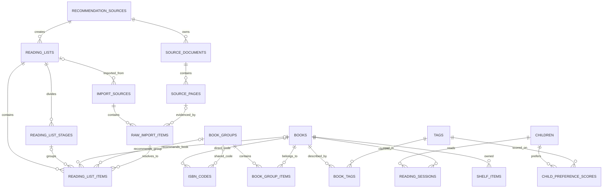

# ReadingMap 数据库设计 v2：精简重构版

> 状态：**审查中草案，暂不可实施**，面向尚未投产的系统。  
> 原则：不兼容旧表；从真实产品查询反推结构；能不建的表现在不建。  
> 日期：2026-09-03。

范围警告：当前草案只完成了书目、达人推荐、原始资料、个人书架和儿童兴趣画像的重设计。初始架构中的能力画像、阅读困难反馈、群体年龄预测、个性化起读预测和路线选择尚未重新设计；它们不是已确认删除的功能，完成全系统审查前不得据此重建数据库。

## 1. 先确认真实需求

当前阶段真正需要支持的业务只有：

1. 搜索一本单本书。
2. 搜索一个系列、级别或套装。
3. 查看系列/级别中包含哪些单本书。
4. 用 ISBN 尝试识别单本书。
5. 印在某一本书背面的 ISBN 可能是单本专属码，也可能是整组共用码；扫码结果必须支持返回一组候选书。
6. 查看某本书或某个系列被哪些达人、在哪个阶段、以什么年龄范围推荐。
7. 保留达人书单原文、图片页和解析结果，便于纠错和重建。
8. 保存个人书架中的单本书。
9. 从每次阅读后的兴趣反馈，持续学习每个孩子的主题与内容偏好。
10. 在能力和年龄合适的候选书中，按孩子的兴趣画像重新排序。

当前阶段不需要：

- 出版版本管理。
- 精装/平装/版次管理。
- 作者主页、作者合并、作者关系图谱。
- 为未来可能出现的字段提前建表。
- 用一个抽象实体层同时代理 `book` 和 `collection`。

## 2. 核心决定

### 2.1 取消统一 `catalog_entities`

单本书直接存 `books`；系列、级别、套装直接存 `book_groups`。

不再使用：

```text
catalog_entities -> works
catalog_entities -> collections
```

改为：

```text
books
book_groups -> book_group_items -> books
```

这样一条单本书数据只存在于 `books`，标题、作者、封面和难度不再跨两张主表重复。

### 2.2 ISBN 按真实识别范围关联

ISBN 使用专用表 `isbn_codes`，每个规范化 ISBN 只保存一次，并且必须明确属于以下一种范围：

```text
单本专属码 -> isbn_codes.book_id -> books.id
整组共用码 -> isbn_codes.shared_group_id -> book_groups.id
```

一个 book 可以有多个单本专属 ISBN，一个 group 也可以有多个共用 ISBN；但同一个 ISBN 不能同时声明为单本码和组共用码。

当套书中的每一本都印着同一个 ISBN 时，只在 `isbn_codes` 保存一条 `shared_group_id`。扫码后通过 `book_group_items` 展开全部成员供用户选择，不把相同 ISBN 复制到每一本书。

这并不表示用户在执行“扫描整套书”。用户仍然是在扫描手上的某一本，只是条码携带的信息只能识别到它所属的组，无法识别具体册。

### 2.3 作者直接放在 `books`

当前没有作者主页、作者简介、作者去重或“按作者关系建图”的需求，因此不建 `authors` 和 `work_authors`。

`books` 直接保存：

```text
author_text
illustrator_text
translator_text
```

多个人名按统一展示格式保存，例如：

```text
Eric Carle；Bill Martin Jr.
```

如果未来真的要做作者详情页或作者跨书统计，再新增人物与贡献关系表；不提前建设。

### 2.4 标签是兴趣画像的基础数据，必须保留

`tags + book_tags` 不是为了做一个标签运营后台，而是为了给每本书建立可解释的内容特征。

```text
tags       = 受控标签字典，例如 theme/动物、genre/幽默
book_tags  = 哪本书具有哪些标签，以及该判断的置信度和来源
```

孩子完成阅读后，通过 `reading_sessions.interest` 记录 love / like / neutral / dislike。系统将反馈与该书的标签结合，更新 `child_preference_scores`。

```text
Book Tags × Reading Interest
        -> Child Preference Scores
        -> 同难度候选书的兴趣排序
```

兴趣画像属于孩子，而不是家庭账号的一张宽泛“用户画像”；并且兴趣必须与阅读能力分开计算。

### 2.5 搜索只查主表

`books` 和 `book_groups` 各自保存 `search_text`，由应用在写入时生成：

```text
search_text = 归一化标题 + 原文标题 + 别名 + 作者
```

精确或前缀搜索使用 `normalized_title` 的 B-Tree 索引；模糊全文搜索使用 `search_text` 的 FULLTEXT 索引。

查询一本书不需要 JOIN、LEFT JOIN 或 DISTINCT。

## 3. 最终业务表

v2 共 18 张业务表：

| 领域 | 表 |
|---|---|
| 书目 | `books`、`isbn_codes`、`book_groups`、`book_group_items` |
| 标签与兴趣画像 | `tags`、`book_tags`、`children`、`reading_sessions`、`child_preference_scores` |
| 达人推荐 | `recommendation_sources`、`reading_lists`、`reading_list_stages`、`reading_list_items` |
| 原始资料 | `import_sources`、`raw_import_items`、`source_documents`、`source_pages` |
| 个人书架 | `shelf_items` |

Alembic 自己的 `alembic_version` 不计入业务表。

## 4. 关系图



## 5. 表结构

以下 DDL 表达字段与约束意图；执行前由 Alembic 生成正式迁移。

### 5.1 `books` — 单本可阅读对象

```sql
CREATE TABLE books (
    id                  BIGINT UNSIGNED AUTO_INCREMENT PRIMARY KEY,
    title               VARCHAR(500) NOT NULL,
    normalized_title    VARCHAR(500) NOT NULL,
    original_title      VARCHAR(500) NULL,
    aliases_json        JSON NULL,

    author_text         VARCHAR(500) NULL,
    illustrator_text    VARCHAR(500) NULL,
    translator_text     VARCHAR(500) NULL,
    language            VARCHAR(32) NULL,

    description         TEXT NULL,
    cover_path          VARCHAR(1000) NULL,
    page_count          INT NULL,
    word_count          INT NULL,
    ar                   DECIMAL(5,2) NULL,
    lexile              INT NULL,

    search_text         TEXT NOT NULL,
    created_at          DATETIME NOT NULL DEFAULT CURRENT_TIMESTAMP,
    updated_at          DATETIME NOT NULL DEFAULT CURRENT_TIMESTAMP
                                      ON UPDATE CURRENT_TIMESTAMP,

    INDEX ix_books_normalized_title (normalized_title),
    FULLTEXT INDEX ft_books_search (search_text) WITH PARSER ngram
) ENGINE=InnoDB DEFAULT CHARSET=utf8mb4 COLLATE=utf8mb4_unicode_ci;
```

说明：

- 一行就是一本可以独立阅读、独立打卡的书。
- 精装、平装、换封面但正文相同，不新增 book。
- 双语版、简写版、分级改写版或正文不同的语言版，新增 book。
- `aliases_json` 只用于回显和维护；搜索统一走 `search_text`。

### 5.2 `isbn_codes` — ISBN 及其识别范围

```sql
CREATE TABLE isbn_codes (
    id                  BIGINT UNSIGNED AUTO_INCREMENT PRIMARY KEY,
    isbn                VARCHAR(13) NOT NULL,
    book_id             BIGINT UNSIGNED NULL,
    shared_group_id     BIGINT UNSIGNED NULL,
    created_at          DATETIME NOT NULL DEFAULT CURRENT_TIMESTAMP,

    CONSTRAINT uq_isbn_codes_isbn UNIQUE (isbn),
    CONSTRAINT ck_isbn_codes_length
        CHECK (CHAR_LENGTH(isbn) IN (10, 13)),
    CONSTRAINT ck_isbn_codes_owner
        CHECK (
            (book_id IS NOT NULL AND shared_group_id IS NULL)
         OR (book_id IS NULL AND shared_group_id IS NOT NULL)
        ),
    CONSTRAINT fk_isbn_codes_book
        FOREIGN KEY (book_id) REFERENCES books(id) ON DELETE CASCADE,
    CONSTRAINT fk_isbn_codes_shared_group
        FOREIGN KEY (shared_group_id) REFERENCES book_groups(id)
        ON DELETE CASCADE,
    INDEX ix_isbn_codes_book (book_id),
    INDEX ix_isbn_codes_shared_group (shared_group_id)
) ENGINE=InnoDB DEFAULT CHARSET=utf8mb4 COLLATE=utf8mb4_unicode_ci;
```

重要：这里的 `shared_group_id` 不是模糊的多态关联，它明确表示“这个码印在该组多个成员上，不能唯一识别具体册”。应用层只允许它指向 `group_type='set'` 的实际成套范围，而不是宽泛的系列或级别。

示例：

```text
isbn 9780000000001 -> shared_group 20

group 20
├── book 101 / Little Bear Goes to the Moon
├── book 102 / Little Bear's Visit
└── book 103 / Father Bear Comes Home
```

扫码 `9780000000001` 后展开 group 20，返回 3 个候选。由于条形码信息本身不足，必须通过书名、封面识别或人工选择具体册。

录入界面提供两个明确选项：

```text
( ) 这是当前单本书的专属 ISBN
( ) 这是整套成员共用的 ISBN
```

选择“整套成员共用”时只保存一次，不需要逐本录入。以后向该组补充新成员时，新成员会自动出现在该 ISBN 的候选结果中。

#### 首次发现与录入流程

系统不能假设用户第一次扫码时已经知道这是共用码，因此需要三种录入选择：

```text
( ) 当前单本书的专属码
( ) 一个具体套装的成员共用码
( ) 暂时不确定
```

- 选择单本专属码：保存 `book_id`。
- 选择成员共用码：先选择或新建一个准确的 `set`，再保存 `shared_group_id`；ISBN 只录一次。
- 选择暂时不确定：仅保留在原始导入/待处理记录中，不立即建立错误的正式关联。
- 如果 ISBN 已经绑定单本，但后来扫描另一册发现同码，界面应提示“把该码转换为套装共用码”，在一次事务中创建/选择 set、加入成员并修改 ISBN 归属。

#### 共用码的边界

- `shared_group_id` 只能指向描述一次真实包装范围的 `set`，不能直接指向宽泛的 `series` 或 `level`。
- 同一本书可以同时属于一个 series、一个 level 和一个具体 set；共用码只展开对应 set。
- 一个系列可能有多个不同册数组合的套装，每个套装应是独立 group，不能共享成员范围假设。
- 如果 set 成员尚未录全，扫码页必须显示“当前仅收录 N 本”，并提供“找不到这一本/补录成员”，不能声称候选完整。
- ISBN 外部 API 返回的可能只是套装商品名，不能据此自动创建一条假单本书。
- 候选选择默认不全选；“加入整套已知成员”必须是用户主动操作。
- 已在个人书架中的候选应明确标记，再次选择时由用户决定忽略还是增加 `quantity`。

### 5.3 `book_groups` — 系列、级别和真实套装

```sql
CREATE TABLE book_groups (
    id                  BIGINT UNSIGNED AUTO_INCREMENT PRIMARY KEY,
    group_type          VARCHAR(16) NOT NULL,
    title               VARCHAR(500) NOT NULL,
    normalized_title    VARCHAR(500) NOT NULL,
    original_title      VARCHAR(500) NULL,
    aliases_json        JSON NULL,
    language            VARCHAR(32) NULL,
    publisher_text      VARCHAR(255) NULL,
    description         TEXT NULL,
    cover_path          VARCHAR(1000) NULL,
    volume_count        INT NULL,
    parent_group_id     BIGINT UNSIGNED NULL,
    level_system        VARCHAR(64) NULL,
    level_value         VARCHAR(64) NULL,
    search_text         TEXT NOT NULL,
    created_at          DATETIME NOT NULL DEFAULT CURRENT_TIMESTAMP,
    updated_at          DATETIME NOT NULL DEFAULT CURRENT_TIMESTAMP
                                      ON UPDATE CURRENT_TIMESTAMP,

    CONSTRAINT ck_book_groups_type
        CHECK (group_type IN ('series', 'level', 'set')),
    CONSTRAINT fk_book_groups_parent
        FOREIGN KEY (parent_group_id) REFERENCES book_groups(id)
        ON DELETE SET NULL,
    INDEX ix_book_groups_type_title (group_type, normalized_title),
    FULLTEXT INDEX ft_book_groups_search (search_text) WITH PARSER ngram
) ENGINE=InnoDB DEFAULT CHARSET=utf8mb4 COLLATE=utf8mb4_unicode_ci;
```

`parent_group_id` 只用于类似下面的结构：

```text
Oxford Reading Tree（series）
└── Stage 1（level）
```

套装仍可作为推荐或购买对象存在。组共用 ISBN 保存在 `isbn_codes.shared_group_id`，而不是 `book_groups` 的普通字段；扫码共用码时返回组内候选书，不自动把整套加入书架。

### 5.4 `book_group_items` — 系列/级别/套装成员

```sql
CREATE TABLE book_group_items (
    group_id    BIGINT UNSIGNED NOT NULL,
    book_id     BIGINT UNSIGNED NOT NULL,
    position    INT NULL,
    volume_no   VARCHAR(64) NULL,

    PRIMARY KEY (group_id, book_id),
    CONSTRAINT fk_group_items_group
        FOREIGN KEY (group_id) REFERENCES book_groups(id) ON DELETE CASCADE,
    CONSTRAINT fk_group_items_book
        FOREIGN KEY (book_id) REFERENCES books(id) ON DELETE CASCADE,
    INDEX ix_group_items_book (book_id)
) ENGINE=InnoDB DEFAULT CHARSET=utf8mb4 COLLATE=utf8mb4_unicode_ci;
```

### 5.5 `recommendation_sources` — 达人/推荐机构

当前一位达人只有一份展示档案，因此不再拆 1:1 profile 表。

```sql
CREATE TABLE recommendation_sources (
    id                      BIGINT UNSIGNED AUTO_INCREMENT PRIMARY KEY,
    name                    VARCHAR(255) NOT NULL,
    source_type             VARCHAR(64) NOT NULL,
    platform                VARCHAR(255) NULL,
    profile_url             VARCHAR(1000) NULL,
    avatar_path             VARCHAR(1000) NULL,
    short_bio               TEXT NULL,
    positioning             VARCHAR(500) NULL,
    methodology_summary     TEXT NULL,
    route_summary           TEXT NULL,
    suitable_for            TEXT NULL,
    cautions                TEXT NULL,
    publications_json       JSON NULL,
    created_at              DATETIME NOT NULL DEFAULT CURRENT_TIMESTAMP,
    updated_at              DATETIME NOT NULL DEFAULT CURRENT_TIMESTAMP
                                              ON UPDATE CURRENT_TIMESTAMP
) ENGINE=InnoDB DEFAULT CHARSET=utf8mb4 COLLATE=utf8mb4_unicode_ci;
```

出版物目前只是达人详情页展示数据，不需要独立查询，所以先放 `publications_json`。

### 5.6 `reading_lists` — 达人书单或路线

```sql
CREATE TABLE reading_lists (
    id              BIGINT UNSIGNED AUTO_INCREMENT PRIMARY KEY,
    source_id       BIGINT UNSIGNED NOT NULL,
    title           VARCHAR(500) NOT NULL,
    list_type       VARCHAR(64) NOT NULL,
    description     TEXT NULL,
    source_url      VARCHAR(1000) NULL,
    published_at    DATE NULL,
    created_at      DATETIME NOT NULL DEFAULT CURRENT_TIMESTAMP,
    updated_at      DATETIME NOT NULL DEFAULT CURRENT_TIMESTAMP
                                  ON UPDATE CURRENT_TIMESTAMP,

    CONSTRAINT fk_reading_lists_source
        FOREIGN KEY (source_id) REFERENCES recommendation_sources(id)
        ON DELETE CASCADE,
    INDEX ix_reading_lists_source (source_id)
) ENGINE=InnoDB DEFAULT CHARSET=utf8mb4 COLLATE=utf8mb4_unicode_ci;
```

### 5.7 `reading_list_stages` — 书单阶段

```sql
CREATE TABLE reading_list_stages (
    id                      BIGINT UNSIGNED AUTO_INCREMENT PRIMARY KEY,
    reading_list_id         BIGINT UNSIGNED NOT NULL,
    stage_order             INT NOT NULL,
    title                   VARCHAR(255) NOT NULL,
    description             TEXT NULL,
    age_min_months          INT NULL,
    age_max_months          INT NULL,
    level_system            VARCHAR(64) NULL,
    level_min               VARCHAR(64) NULL,
    level_max               VARCHAR(64) NULL,

    CONSTRAINT fk_list_stages_list
        FOREIGN KEY (reading_list_id) REFERENCES reading_lists(id)
        ON DELETE CASCADE,
    CONSTRAINT uq_list_stage_order
        UNIQUE (reading_list_id, stage_order)
) ENGINE=InnoDB DEFAULT CHARSET=utf8mb4 COLLATE=utf8mb4_unicode_ci;
```

### 5.8 `reading_list_items` — 一条推荐结果

```sql
CREATE TABLE reading_list_items (
    id                      BIGINT UNSIGNED AUTO_INCREMENT PRIMARY KEY,
    reading_list_id         BIGINT UNSIGNED NOT NULL,
    stage_id                BIGINT UNSIGNED NULL,
    raw_import_item_id      BIGINT UNSIGNED NOT NULL,

    book_id                 BIGINT UNSIGNED NULL,
    group_id                BIGINT UNSIGNED NULL,
    non_catalog_type        VARCHAR(32) NULL,

    position                INT NULL,
    age_min_months          INT NULL,
    age_max_months          INT NULL,
    recommended_ar          DECIMAL(5,2) NULL,
    recommended_lexile      INT NULL,
    comment                 TEXT NULL,
    annotations_json        JSON NULL,

    CONSTRAINT fk_list_items_list
        FOREIGN KEY (reading_list_id) REFERENCES reading_lists(id)
        ON DELETE CASCADE,
    CONSTRAINT fk_list_items_stage
        FOREIGN KEY (stage_id) REFERENCES reading_list_stages(id)
        ON DELETE SET NULL,
    CONSTRAINT fk_list_items_raw
        FOREIGN KEY (raw_import_item_id) REFERENCES raw_import_items(id)
        ON DELETE RESTRICT,
    CONSTRAINT fk_list_items_book
        FOREIGN KEY (book_id) REFERENCES books(id) ON DELETE SET NULL,
    CONSTRAINT fk_list_items_group
        FOREIGN KEY (group_id) REFERENCES book_groups(id) ON DELETE SET NULL,
    CONSTRAINT ck_list_item_target
        CHECK (
            (book_id IS NOT NULL AND group_id IS NULL AND non_catalog_type IS NULL)
         OR (book_id IS NULL AND group_id IS NOT NULL AND non_catalog_type IS NULL)
         OR (book_id IS NULL AND group_id IS NULL AND non_catalog_type IS NOT NULL)
        ),
    INDEX ix_list_items_book (book_id),
    INDEX ix_list_items_group (group_id),
    INDEX ix_list_items_list_position (reading_list_id, position)
) ENGINE=InnoDB DEFAULT CHARSET=utf8mb4 COLLATE=utf8mb4_unicode_ci;
```

这里只保留两个明确目录目标：单本书或书组。动画、音频、App 等非书内容使用 `non_catalog_type`，不为它们创建假书目。

一条原始资料如果写“第 1–3 级”，可以生成三条 `reading_list_items`，三条记录共同指向同一个 `raw_import_item_id`。

### 5.9 `import_sources` — 一次导入

```sql
CREATE TABLE import_sources (
    id              BIGINT UNSIGNED AUTO_INCREMENT PRIMARY KEY,
    reading_list_id BIGINT UNSIGNED NULL,
    source_type     VARCHAR(64) NOT NULL,
    source_name     VARCHAR(500) NOT NULL,
    source_url      VARCHAR(1000) NULL,
    filename        VARCHAR(500) NULL,
    status          VARCHAR(32) NOT NULL,
    imported_at     DATETIME NOT NULL DEFAULT CURRENT_TIMESTAMP,

    CONSTRAINT fk_import_sources_list
        FOREIGN KEY (reading_list_id) REFERENCES reading_lists(id)
        ON DELETE SET NULL,
    INDEX ix_import_sources_list (reading_list_id)
) ENGINE=InnoDB DEFAULT CHARSET=utf8mb4 COLLATE=utf8mb4_unicode_ci;
```

不限制一个书单只能导入一次。重新导入、修订版导入应分别保留记录。

### 5.10 `raw_import_items` — 原始资料条目

```sql
CREATE TABLE raw_import_items (
    id                  BIGINT UNSIGNED AUTO_INCREMENT PRIMARY KEY,
    import_source_id    BIGINT UNSIGNED NOT NULL,
    source_page_id      BIGINT UNSIGNED NULL,
    position            INT NULL,
    raw_title           VARCHAR(500) NOT NULL,
    raw_author          VARCHAR(500) NULL,
    raw_text            TEXT NULL,
    raw_metadata        JSON NULL,
    resolve_status      VARCHAR(32) NOT NULL DEFAULT 'pending',
    resolve_source      VARCHAR(16) NOT NULL DEFAULT 'auto',
    resolve_confidence  DECIMAL(4,3) NULL,
    manual_note         TEXT NULL,
    created_at          DATETIME NOT NULL DEFAULT CURRENT_TIMESTAMP,
    updated_at          DATETIME NOT NULL DEFAULT CURRENT_TIMESTAMP
                                      ON UPDATE CURRENT_TIMESTAMP,

    CONSTRAINT fk_raw_items_import
        FOREIGN KEY (import_source_id) REFERENCES import_sources(id)
        ON DELETE CASCADE,
    CONSTRAINT fk_raw_items_page
        FOREIGN KEY (source_page_id) REFERENCES source_pages(id)
        ON DELETE SET NULL,
    INDEX ix_raw_items_import (import_source_id),
    INDEX ix_raw_items_status (resolve_status)
) ENGINE=InnoDB DEFAULT CHARSET=utf8mb4 COLLATE=utf8mb4_unicode_ci;
```

解析结果由 `reading_list_items` 表达，不在本表再保存一个只能容纳单结果的 `resolved_catalog_entity_id`。

### 5.11 `source_documents` — 达人原始文档

```sql
CREATE TABLE source_documents (
    id              BIGINT UNSIGNED AUTO_INCREMENT PRIMARY KEY,
    source_id       BIGINT UNSIGNED NOT NULL,
    reading_list_id BIGINT UNSIGNED NULL,
    title           VARCHAR(500) NOT NULL,
    document_type   VARCHAR(64) NOT NULL,
    source_path     VARCHAR(1000) NOT NULL,
    source_url      VARCHAR(1000) NULL,
    notes           TEXT NULL,
    created_at      DATETIME NOT NULL DEFAULT CURRENT_TIMESTAMP,

    CONSTRAINT fk_source_documents_source
        FOREIGN KEY (source_id) REFERENCES recommendation_sources(id)
        ON DELETE CASCADE,
    CONSTRAINT fk_source_documents_list
        FOREIGN KEY (reading_list_id) REFERENCES reading_lists(id)
        ON DELETE SET NULL,
    INDEX ix_source_documents_source (source_id),
    INDEX ix_source_documents_list (reading_list_id)
) ENGINE=InnoDB DEFAULT CHARSET=utf8mb4 COLLATE=utf8mb4_unicode_ci;
```

### 5.12 `source_pages` — 文档页面

```sql
CREATE TABLE source_pages (
    id              BIGINT UNSIGNED AUTO_INCREMENT PRIMARY KEY,
    document_id     BIGINT UNSIGNED NOT NULL,
    page_order      INT NOT NULL,
    file_path       VARCHAR(1000) NOT NULL,
    file_name       VARCHAR(500) NOT NULL,
    mime_type       VARCHAR(128) NULL,
    checksum        VARCHAR(128) NULL,
    width           INT NULL,
    height          INT NULL,

    CONSTRAINT fk_source_pages_document
        FOREIGN KEY (document_id) REFERENCES source_documents(id)
        ON DELETE CASCADE,
    CONSTRAINT uq_source_page_order
        UNIQUE (document_id, page_order)
) ENGINE=InnoDB DEFAULT CHARSET=utf8mb4 COLLATE=utf8mb4_unicode_ci;
```

### 5.13 `shelf_items` — 个人拥有的单本书

```sql
CREATE TABLE shelf_items (
    id          BIGINT UNSIGNED AUTO_INCREMENT PRIMARY KEY,
    book_id     BIGINT UNSIGNED NOT NULL,
    position    INT NULL,
    quantity    INT NOT NULL DEFAULT 1,
    status      VARCHAR(32) NULL,
    note        TEXT NULL,
    added_at    DATETIME NOT NULL DEFAULT CURRENT_TIMESTAMP,

    CONSTRAINT fk_shelf_items_book
        FOREIGN KEY (book_id) REFERENCES books(id) ON DELETE CASCADE,
    CONSTRAINT uq_shelf_book UNIQUE (book_id),
    CONSTRAINT ck_shelf_quantity CHECK (quantity > 0)
) ENGINE=InnoDB DEFAULT CHARSET=utf8mb4 COLLATE=utf8mb4_unicode_ci;
```

当前是单用户本地系统，不建 `users` 和 `shelves`。开始做多用户或多个书架时再新增。

### 5.14 `tags` — 受控内容标签

```sql
CREATE TABLE tags (
    id                  BIGINT UNSIGNED AUTO_INCREMENT PRIMARY KEY,
    category            VARCHAR(64) NOT NULL,
    name                VARCHAR(255) NOT NULL,
    normalized_name     VARCHAR(255) NOT NULL,

    CONSTRAINT uq_tags_category_name
        UNIQUE (category, normalized_name),
    INDEX ix_tags_name (normalized_name)
) ENGINE=InnoDB DEFAULT CHARSET=utf8mb4 COLLATE=utf8mb4_unicode_ci;
```

第一版标签类别：

```text
theme          主题：动物、家庭、学校、友情、成长
genre          类型：幽默、冒险、科普、幻想
character      角色：恐龙、车辆、公主、机器人
emotion        情绪：害怕、愤怒、分离、勇气
style          风格：可爱、强冲突、温柔、荒诞
setting        场景：家庭、学校、自然、太空
reading_form   阅读形式：重复句、押韵、互动、无字书
topic          知识话题：身体、天气、工程、动物习性
```

`tags` 的价值是保证“恐龙”“dinosaur”“恐龙类”不会被当成三个无法汇总的偏好维度。

### 5.15 `book_tags` — 书的内容特征

```sql
CREATE TABLE book_tags (
    book_id         BIGINT UNSIGNED NOT NULL,
    tag_id          BIGINT UNSIGNED NOT NULL,
    confidence      DECIMAL(4,3) NULL,
    source          VARCHAR(32) NOT NULL,
    created_at      DATETIME NOT NULL DEFAULT CURRENT_TIMESTAMP,

    PRIMARY KEY (book_id, tag_id),
    CONSTRAINT fk_book_tags_book
        FOREIGN KEY (book_id) REFERENCES books(id) ON DELETE CASCADE,
    CONSTRAINT fk_book_tags_tag
        FOREIGN KEY (tag_id) REFERENCES tags(id) ON DELETE CASCADE,
    CONSTRAINT ck_book_tags_confidence
        CHECK (confidence IS NULL OR confidence BETWEEN 0 AND 1),
    INDEX ix_book_tags_tag (tag_id)
) ENGINE=InnoDB DEFAULT CHARSET=utf8mb4 COLLATE=utf8mb4_unicode_ci;
```

`source` 建议当前只使用 `manual`、`import`、`ai`。人工判断优先于自动标注。

### 5.16 `children` — 儿童档案

```sql
CREATE TABLE children (
    id          BIGINT UNSIGNED AUTO_INCREMENT PRIMARY KEY,
    name        VARCHAR(100) NOT NULL,
    birth_date  DATE NULL,
    created_at  DATETIME NOT NULL DEFAULT CURRENT_TIMESTAMP,
    updated_at  DATETIME NOT NULL DEFAULT CURRENT_TIMESTAMP
                              ON UPDATE CURRENT_TIMESTAMP
) ENGINE=InnoDB DEFAULT CHARSET=utf8mb4 COLLATE=utf8mb4_unicode_ci;
```

兴趣画像按 child 隔离；同一家庭中不同孩子不能共享一份偏好分数。

### 5.17 `reading_sessions` — 阅读打卡与反馈

```sql
CREATE TABLE reading_sessions (
    id              BIGINT UNSIGNED AUTO_INCREMENT PRIMARY KEY,
    child_id        BIGINT UNSIGNED NOT NULL,
    book_id         BIGINT UNSIGNED NOT NULL,
    read_at         DATETIME NOT NULL,
    reading_mode    VARCHAR(32) NULL,
    overall_fit     VARCHAR(32) NULL,
    completion      VARCHAR(32) NULL,
    interest        VARCHAR(16) NULL,
    notes           TEXT NULL,
    created_at      DATETIME NOT NULL DEFAULT CURRENT_TIMESTAMP,

    CONSTRAINT fk_reading_sessions_child
        FOREIGN KEY (child_id) REFERENCES children(id) ON DELETE CASCADE,
    CONSTRAINT fk_reading_sessions_book
        FOREIGN KEY (book_id) REFERENCES books(id) ON DELETE RESTRICT,
    CONSTRAINT ck_reading_sessions_interest
        CHECK (interest IS NULL OR interest IN ('love', 'like', 'neutral', 'dislike')),
    INDEX ix_reading_sessions_child_time (child_id, read_at),
    INDEX ix_reading_sessions_book (book_id)
) ENGINE=InnoDB DEFAULT CHARSET=utf8mb4 COLLATE=utf8mb4_unicode_ci;
```

打卡输入仍保持简单：读了什么、读得顺不顺、喜欢吗。`interest` 更新兴趣画像，`overall_fit` 更新能力画像，两者不混用。

### 5.18 `child_preference_scores` — 儿童兴趣画像

```sql
CREATE TABLE child_preference_scores (
    child_id       BIGINT UNSIGNED NOT NULL,
    tag_id         BIGINT UNSIGNED NOT NULL,
    score          DECIMAL(6,3) NOT NULL,
    confidence     DECIMAL(4,3) NOT NULL,
    evidence_count INT NOT NULL,
    updated_at     DATETIME NOT NULL DEFAULT CURRENT_TIMESTAMP
                                  ON UPDATE CURRENT_TIMESTAMP,

    PRIMARY KEY (child_id, tag_id),
    CONSTRAINT fk_preference_scores_child
        FOREIGN KEY (child_id) REFERENCES children(id) ON DELETE CASCADE,
    CONSTRAINT fk_preference_scores_tag
        FOREIGN KEY (tag_id) REFERENCES tags(id) ON DELETE CASCADE,
    CONSTRAINT ck_preference_confidence
        CHECK (confidence BETWEEN 0 AND 1),
    CONSTRAINT ck_preference_evidence
        CHECK (evidence_count >= 0),
    INDEX ix_preference_scores_child_score (child_id, score)
) ENGINE=InnoDB DEFAULT CHARSET=utf8mb4 COLLATE=utf8mb4_unicode_ci;
```

`score` 表示偏好方向和强度；`confidence` 表示系统对该结论有多确信；`evidence_count` 防止“一次喜欢”与“二十次稳定喜欢”被视为同等证据。

## 6. 五个关键查询

### 6.1 搜索书名

小数据量阶段可以直接查一张表：

```sql
SELECT *
FROM books
WHERE search_text LIKE CONCAT('%', :normalized_query, '%')
ORDER BY title
LIMIT 50;
```

数据量增长后改用已有 FULLTEXT 索引：

```sql
SELECT *
FROM books
WHERE MATCH(search_text) AGAINST(:query IN BOOLEAN MODE)
LIMIT 50;
```

两种查询都不需要 JOIN 或 DISTINCT。

### 6.2 扫 ISBN

```sql
SELECT id, book_id, shared_group_id
FROM isbn_codes
WHERE isbn = :isbn;
```

处理规则：

- 查不到：未收录，进入搜索或补录流程。
- `book_id` 非空：直接返回该书。
- `shared_group_id` 非空：再通过 `book_group_items` 查询组内全部书，显示复选候选列表。

```sql
SELECT b.*, item.position, item.volume_no
FROM isbn_codes code
JOIN book_group_items item
  ON item.group_id = code.shared_group_id
JOIN books b
  ON b.id = item.book_id
WHERE code.isbn = :isbn
ORDER BY item.position, b.id;
```

候选界面提供“只加入所选书”和“全选当前已知成员”，但默认不全选，避免一次误操作加入整套。

### 6.3 展开系列或级别

```sql
SELECT b.*, item.position, item.volume_no
FROM book_group_items item
JOIN books b ON b.id = item.book_id
WHERE item.group_id = :group_id
ORDER BY item.position, b.id;
```

### 6.4 查询一本书被谁推荐

```sql
SELECT
    source.name,
    list.title AS list_title,
    stage.title AS stage_title,
    item.age_min_months,
    item.age_max_months,
    item.comment
FROM reading_list_items item
JOIN reading_lists list ON list.id = item.reading_list_id
JOIN recommendation_sources source ON source.id = list.source_id
LEFT JOIN reading_list_stages stage ON stage.id = item.stage_id
WHERE item.book_id = :book_id
ORDER BY source.name, list.id, item.position;
```

### 6.5 查询孩子的兴趣画像

```sql
SELECT
    tag.category,
    tag.name,
    pref.score,
    pref.confidence,
    pref.evidence_count
FROM child_preference_scores pref
JOIN tags tag ON tag.id = pref.tag_id
WHERE pref.child_id = :child_id
ORDER BY pref.score DESC, pref.confidence DESC;
```

推荐时先用年龄和能力条件选出适合的候选书，再用 `book_tags × child_preference_scores` 计算兴趣加分；兴趣只负责同等适读候选间的排序，不应让推荐路线永远只剩一种题材。

## 7. 明确删除的旧表

重建时不再创建：

```text
catalog_entities
catalog_identifiers
catalog_title_aliases
catalog_source_stats
works
work_aliases
content_variants
editions
authors
work_authors
work_tags
collections
collection_items
series
series_items
recommendation_source_profiles
recommendation_source_publications
recommendation_source_knowledge
recommendation_evidence
recommendation_item_annotations
import_batches
import_rows
```

对应替代关系：

| 旧结构 | 新结构 |
|---|---|
| `catalog_entities + works` | `books` |
| `catalog_entities + collections` | `book_groups` |
| `collection_items / series_items` | `book_group_items` |
| `catalog_identifiers / editions.isbn*` | `isbn_codes` |
| `catalog_title_aliases / work_aliases` | `aliases_json + search_text` |
| `authors / work_authors` | `books.author_text` 等直接字段 |
| `tags / work_tags` | 保留概念，按新书表命名为 `tags / book_tags` |
| `recommendation_evidence / annotations` | 推荐条目直接字段 + `annotations_json` |
| `recommendation_source_profiles` | 合并进 `recommendation_sources` |
| `recommendation_source_publications` | `recommendation_sources.publications_json` |

## 8. 重建策略

系统尚未投产，不进行旧结构兼容迁移。执行时采用：

1. 保留现有数据库备份。
2. 将达人原始书单、页面文件和必要原始字段作为重建输入。
3. 创建全新的 v2 数据库或清空后重新建表。
4. 从原始资料生成 `books`、`book_groups` 和推荐关系。
5. ISBN 全部归一化后写入 `isbn_codes`；单本码关联 `book_id`，共用码关联 `shared_group_id`。
6. 对组共用 ISBN 建立自动化测试，确保扫码接口返回该组成员候选数组。
7. 对书名搜索、系列展开、推荐反查和原始资料追溯分别建立测试。
8. 验证完成后再切换 API，不保留旧表兼容代码。

### 8.1 尚未纳入、但不得视为删除的初始模块

以下初始表暂未进入本草案，需要逐项根据产品闭环重新设计：

```text
difficulty_evidence
book_fact_summaries
ability_dimensions
book_requirement_profiles
book_requirement_scores
population_age_predictions
route_selections
reading_feedback
child_ability_scores
personalized_age_predictions
```

它们承载的能力画像、难度解释、路线跟随和个性化年龄预测属于原产品的重要能力。下一版必须明确每项是保留原表、合并、改为计算结果，还是有充分理由删除；不能因为 Phase 1 尚未实现就直接移除。

## 9. 设计底线

- 没有明确查询需求，不建表。
- 同一事实只保存一个权威位置；`search_text` 是明确允许的查询缓存，不是第二份业务事实。
- ISBN 在 `isbn_codes` 中全局唯一，但可以通过 `shared_group_id` 合法解析为多个候选书。
- 条形码无法区分的多本书，数据库也不能假装能区分。
- 原始资料不覆盖、不丢失；解析结果可以重建。
- 书、系列、推荐意见、原始资料是四类不同事实，但每一类内部保持简单。
